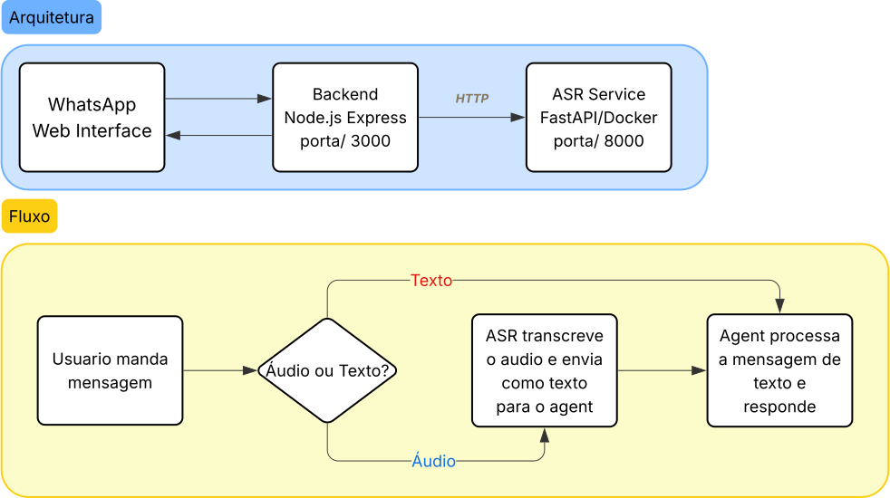

# ConfIA-POC-Agent

## Contexto e Roadmap

Proof of Concept (POC) de um agente conversacional integrado (texto e voz) projetado para operar através de três interfaces: WhatsApp, Web e App Mobile (Progressive Web App, PWA).

Pontos-chave do projeto:

- **Processamento de Voz:** Reutilização de um microsserviço ASR (Docker/FastAPI) já existente para transcrição de áudio nativa.

- **Domínio de Teste:** O agente atuará como assistente virtual de e-commerce, consumindo um catálogo de dados fictícios (produtos, status de pedidos e suporte).

- **Foco Estratégico:** Prioridade total na validação da arquitetura de microsserviços e na qualidade semântica/conversacional da IA, mantendo as interfaces de usuário (UI) estritamente funcional e minimalista.

_Atualmente, o bot opera exclusivamente através do WhatsApp. O objetivo a médio e longo prazo é expandir o projeto criando uma interface web e, se viável, um aplicativo mobile. Essa expansão nos permitirá realizar testes de usabilidade e entender qual plataforma oferece a melhor experiência para o usuário._

## Status das Interfaces

| Interface | Status |
| :--- | :--- |
| WhatsApp | ✅ [(Unstable)](#)|
| Web | ❌ [(TO DO)](#) |
| Aplicativo (Mobile) | ❌ [(TO DO)](#) |

## Arquitetura



- **Backend** — API Gateway que orquestra o agente conversacional (LLM via OpenRouter) e interfaces de usuário.
- **ASR** — Microsserviço independente de transcrição de áudio (Whisper PT-BR), containerizado via Docker.

## Pré-requisitos

- [Node.js](https://nodejs.org/) >= 20
- [Docker](https://docs.docker.com/get-docker/) e [Docker Compose](https://docs.docker.com/compose/)
- Conta na [OpenRouter](https://openrouter.ai/) (chave de API para o LLM)
- Token do [Hugging Face](https://huggingface.co/settings/tokens) (para download dos modelos ASR)

## Setup

### 1. Clone o repositório

```bash
git clone https://github.com/DehPython/ConfIA-POC-Agent.git
cd ConfIA-POC-Agent
```

### 2. Configure as variáveis de ambiente

**ASR:**
```bash
cp asr/.env.example asr/.env
```
Preencha o `HF_TOKEN` com seu token do Hugging Face.

**Backend:**
```bash
cp backend/.env.example backend/.env
```
Preencha as variáveis — no mínimo `LLM_API_KEY`. Veja o `.env.example` para descrição de cada uma.

### 3. Suba o microsserviço ASR

```bash
docker compose up asr
```

Na primeira execução, a imagem será construída e o modelo será baixado (pode levar alguns minutos). O serviço estará pronto quando o log exibir `Uvicorn running on 0.0.0.0:8000`.

Para verificar:
```bash
curl http://localhost:8000/health
```

> **Tem GPU NVIDIA?** Use o override para aceleração via CUDA:
> ```bash
> docker compose -f docker-compose.yml -f docker-compose.gpu.yml up asr
> ```
> O código do ASR detecta CUDA automaticamente.

### 4. Inicie o backend

Em outro terminal:

```bash
cd backend
npm install
npm run dev
```

Um QR Code será exibido no terminal. Escaneie-o com o seu WhatsApp para autenticar a sessão (similar ao WhatsApp Web).

## Modelos ASR Disponíveis

A escolha do modelo é feita pela variável `ASR_MODEL_ID` no `backend/.env`:

| ID | Modelo | Característica |
| :--- | :--- | :--- |
| `freds0` | Distil Whisper PT-BR | Mais leve e rápido |
| `lite_asr` | LiteASR Custom | Mais pesado, porém mais preciso |

## Stack Completa (Opcional)

Para rodar tudo containerizado (útil para CI ou demos):

```bash
docker compose --profile full up
```

Para visualizar o QR Code do WhatsApp quando em container:
```bash
docker attach paradox-backend
```

## Variáveis de Ambiente

### ASR (`asr/.env`)

| Variável | Descrição |
| :--- | :--- |
| `HF_TOKEN` | Token do Hugging Face para download dos modelos <br> _(Não é obrigatório mas acelera o download dos modelos)_

### Backend (`backend/.env`)

Recomendado deixar o default no que não for obrigátorio, configure apenas se quiser...

| Variável | Descrição | Default | Obrigatório? |
| :--- | :--- | :--- | :---: |
| `LLM_BASE_URL` | URL base da API do LLM | `https://openrouter.ai/api/v1` |✅|
| `LLM_MODEL` | ID do modelo LLM na OpenRouter | {COLOQUE_ID_DO_LLM} |✅|
| `LLM_API_KEY` | Chave de API da OpenRouter | {COLOQUE_SUA_CHAVE_API} |✅|
| `ASR_URL` | URL do microsserviço ASR | `http://localhost:8000` |❌|
| `ASR_MODEL_ID` | Modelo de transcrição (`freds0` ou `lite_asr`) | `lite_asr` |✅|
| `WHATSAPP_ENABLED` | Ativa/desativa o bot WhatsApp | `true` |❌|
| `WHATSAPP_ATTENDANT_NUMBER` | Número do atendente humano no WhatsApp | {COLOQUE_SEU_NUMERO_DE_ATENDENTE} |❌|
| `WEB_PORT` | Porta do servidor Express | `3000` |❌|
| `NODE_ENV` | Ambiente de execução | `development` |❌|
| `LOG_LEVEL` | Nível de log | `info` |❌|
| `CONVERSATION_TIMEOUT_MIN` | Timeout da memória do agente (minutos) | `120` |❌|
